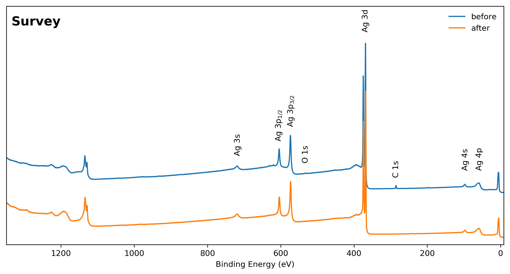
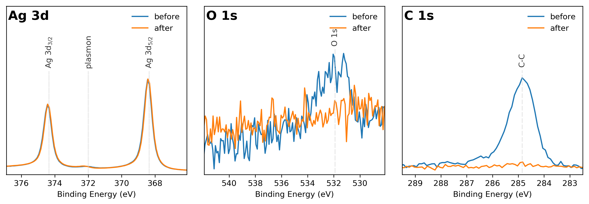
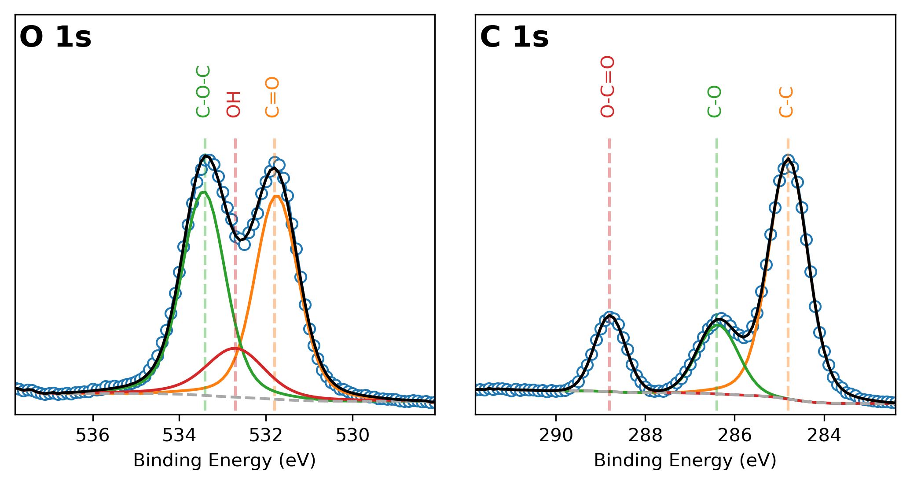

# Summary

The Avantage data system [@avantage:2005] written by Thermo Scientific is a software package that handles all the operations of their XPS systems:
K-Alpha, Nexsa, ESCALAB and Theta Probe. It also provides the essential tools (background subtraction, peaks fitting and elemental composition)
for scientists to analyse the acquired XPS data. Analysed data can then be exported as Microsoft Excel (XLS) files with a format specific to 
Avantage. A considerable amount of time is then often spent to process and present the data to a publication-ready format.

The python program ``AvantageToPlot`` alleviates this problem by making use of ``Pandas``[@pandas:2011], ``Matplotlib`` [@Numpy:2011, @matplotlib:2007] and 
``Python-pptx`` [@pptx:2018] to extract exported Avantage XLS datafiles into sets of publication-ready plots embedded in a Microsoft PowerPoint (PPT) presentation. 
``AvantageToPlot`` can process single or multiple datafiles and provides automated binding energy correction, data normalisation, 
automated peaks labelling, shirley background correction and quantification. The publication-ready plots are also output 
into image files of PNG and SVG formats. SVG format images can be further edited using ``Inskape`` [@inkscape:2009] if required.
The PPT file generated has the following structure: 

* Slides for individual samples
	* Slide 1: plot of a survey spectrum with labels.
	* Slide 2: plots of all core levels  with labels from the line settings.
	* Slide 3: plots of all core levels with background corection and labels. 
	* Slide 4: plot of the valence band if available.
	* Slide 5: Quantification table if available.
* Slides for the comparison of multiple samples
	* Slide 1: plot of multiple survey spectra with labels.
	* Slide 2: plots of all core levels with labels from multiple files (samples).
	* Slide 3: plots of all core levels from multiple files (samples) with background corection and labels.
	* Slide 4: plot of the valence band of multiple samples if available.

# Configuration file

The configuration of ``AvantageToPlot`` is done in a simple XLS file of structure well documented in the manual. The XLS file consists of three
worksheets namely the main settings, plot settings, line Settings. While the main settings worksheet contains all the general configurations, the plot and line
settings worksheet contain the settings of the plots (minimum and maximum) and the labelling of the core levels.

# GUI front end

``AvantageToPlot`` has a GUI front end (see Fig. \ref{frontend1}) built by Tkinter and allows the direct visualisation of the produced survey, core levels and valence band from single
data and multiple data. This enable the direct verification of the generated output plots and to make changes without having to open the generated PPT file.

# Suported core levels

``AvantageToPlot`` can plot all core levels however currently only the following core levels can be plotted in multiple data plots (more to be added in the upcoming versions): 
F 1*s*, B 1*s*, C 1*s*, N 1*s*, Na 1*s*, Li 1*s*, O 1*s*, Al 2*p*, S 2*p*, Ti 2*p*, Si 2*p*, P 2*p*, Ga 2*p*, Zn 2*p*, Ni 2*p*, Cr 2*p*, Co 2*p*, Fe 2*p*, Mn 2*p*, 
Ru 3*p*, Sr 3*p*, I 3*d*, Ru 3*d*, Y 3*d*, Zr 3*d*, Ag 3*d*, La 3*d*, La 4*d*, Ce 3*d*, Ce 4*d*, Sr 3*d*, Pb 4*f*, Au 4*f*

# Examples of publication-ready plots

Figs. \ref{survey1} and \ref{corelevels1} show XPS surveys spectra and comparison plots of the Ag 3*d*, O 1*s* and C 1*s* core levels
from a silver sample before and after sputtering. The spectra produced by ``AvantageToPlot`` shows the quality of the 
formatting and peaks labelling.  The data normalised by the area of the Ag 3*d* shows the decrease of the carbon
and oxygen core level intensity at the surface. Fig. \ref{corefitted1} shows an example of the peak fitted C 1*s* and O 1*s* core 
levels spectra from a Polyethylene Terephthalate (PET) sample. The peak fitting was done on the Avantage software before final processing on
``AvantageToPlot``.

# Acknowledgements

The authors wish to acknowledge the Engineering and Physical Sciences Research Council (EP/M014304/1) for the Financial support. 

# References